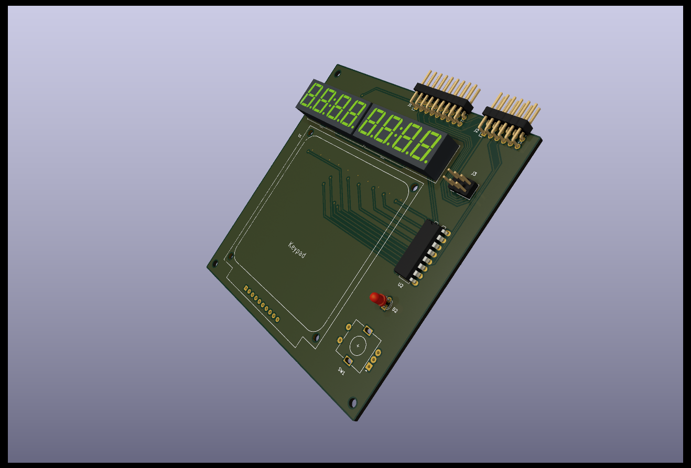
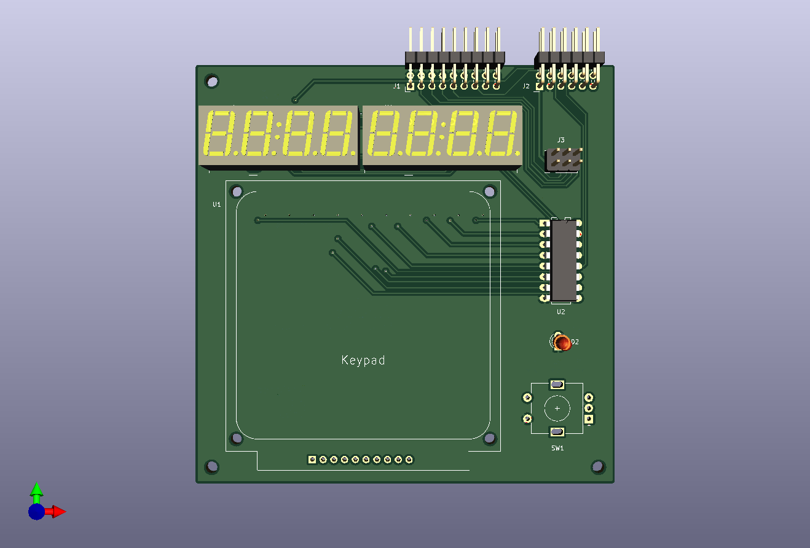
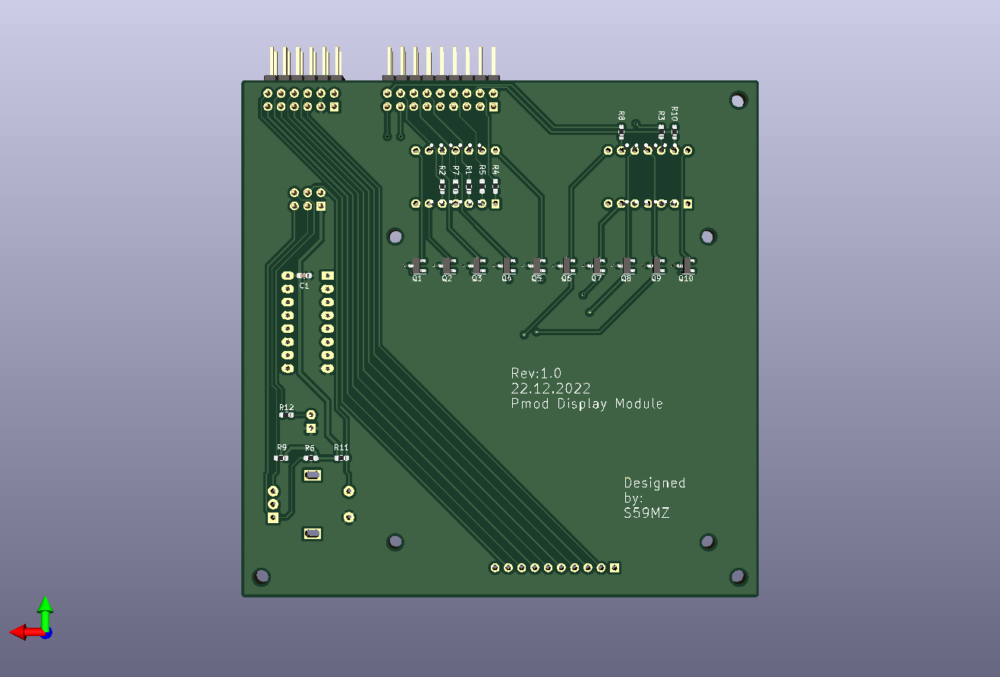

# kicad-display_10dig
A simple 10-digit 7-segment display with keyboard and PMOD interface

Schematic:
[display_10dig.pdf](display_10dig.pdf)

BOM:
[display_10dig.csv](display_10dig.csv)

Gerbers:
[gerbers.zip](https://github.com/s59mz/kicad-display_10dig/raw/main/gerbers.zip)
~                                                                           
